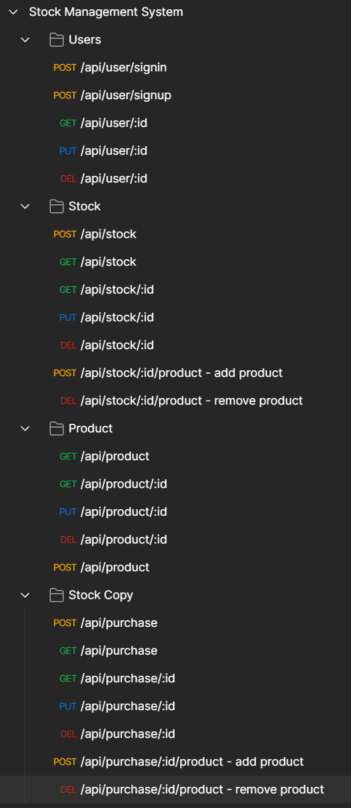

Stock Management System

In this project we have 3 main entities:
- Stock
- Product
- Purchase

We can add / remove / edit all of those entities.
Also we can manage stock products using Purchase. 
Purchase contains two types of products transactions - Income and Outcome.
This system allows us to control purchase status from payment to delivery.

Endpoints:

Default credentials: admin, admin
You should set up jwt authorization in postman after collection import

Starting project:
docker-compose up -d
